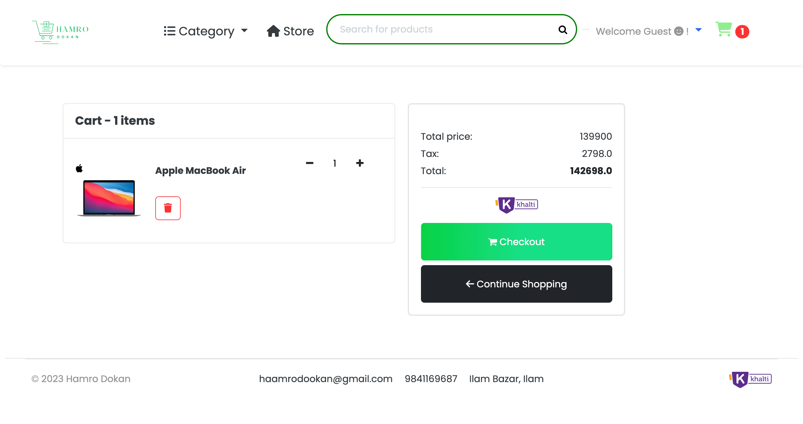

# Ecommerce with django and Khalti Payment

# Setup - Virutal Environment
Fork this repo or download zip, open termial inside the project folder and follow:

```bash
python -m venv .venv
source .venv/bin/activate
```
Install requirements:

```bash
python -m pip install -r requirements.txt 
```

Run the server

```bash
python manage.py runserver
```

# Setup DOCKER
`docker-compose up -d --build`


### Screenshot





